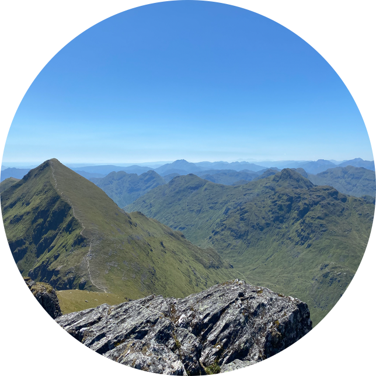

<br />
<div align="center">
  <a>
    
  </a>

<h1>Hiking App</h1>

<h2>Aaron Savage</h3>

  <p>
    University of Strathcyde 4th Year Dissertation Project
  </p>
</div>

<!-- ABOUT THE PROJECT -->
## About The Project

This project was developed as part of class CS408 at the University of Strathclyde 2022-2023. The world has changed
dramatically since the COVID-19 pandemic. Many people around the world feel more isolated from one another and social
activities are critical for our mental health. One of the social activities that has gained massively in popularity
since COVID-19 is hill walking. This project aimed to create a mobile application that provided hiking beginners with
the tools to become interested in hiking and to join the hiking community.

### Built With

[![React Native][React-Native.js]][React-Native-url]
[![Spring][Spring]][Spring-url]

<!-- GETTING STARTED -->
## Getting Started

Following these instructions will instruct you how to get the project set up locally and running. The project
environment instructions are targeted for Apple Mac Users.

### Prerequisites

Follow this [link](https://reactnative.dev/docs/environment-setup) to follow React Native's own environment
instructions.

### Installation

1. Clone the back-end repo
   ```sh
   git clone https://gitlab.cis.strath.ac.uk/ftb18141/hiking-server.git
   ```
2. Clone the front-end repo
   ```sh
   git clone https://gitlab.cis.strath.ac.uk/ftb18141/hiking-ui.git
   ```
3. Build back-end
   ```sh
   gradle clean build
   ```
4. Start back-end
   ```sh
   gradle bootRun
   ```
5. Install front-end dependencies
   ```sh
   npm install
   ```
6. Start front-end
   ```sh
   npm start
   ```
7. In new terminal navigate to hiking-ui folder
    ```sh
    npx react-native run-ios
    ```

<!-- ACKNOWLEDGMENTS -->
## Acknowledgments

* Prof. Feng Dong
* Dr. Daniel Thomas

[React-Native.js]: https://storage.googleapis.com/moravio-web/media/react_native_e0c7e12161/react_native_e0c7e12161.png
[React-Native-url]: https://reactnative.dev/
[Spring]: https://res.cloudinary.com/crunchbase-production/image/upload/c_lpad,h_256,w_256,f_auto,q_auto:eco,dpr_1/mpwuzfuyyl8haojedjp8
[Spring-url]: https://spring.io/
